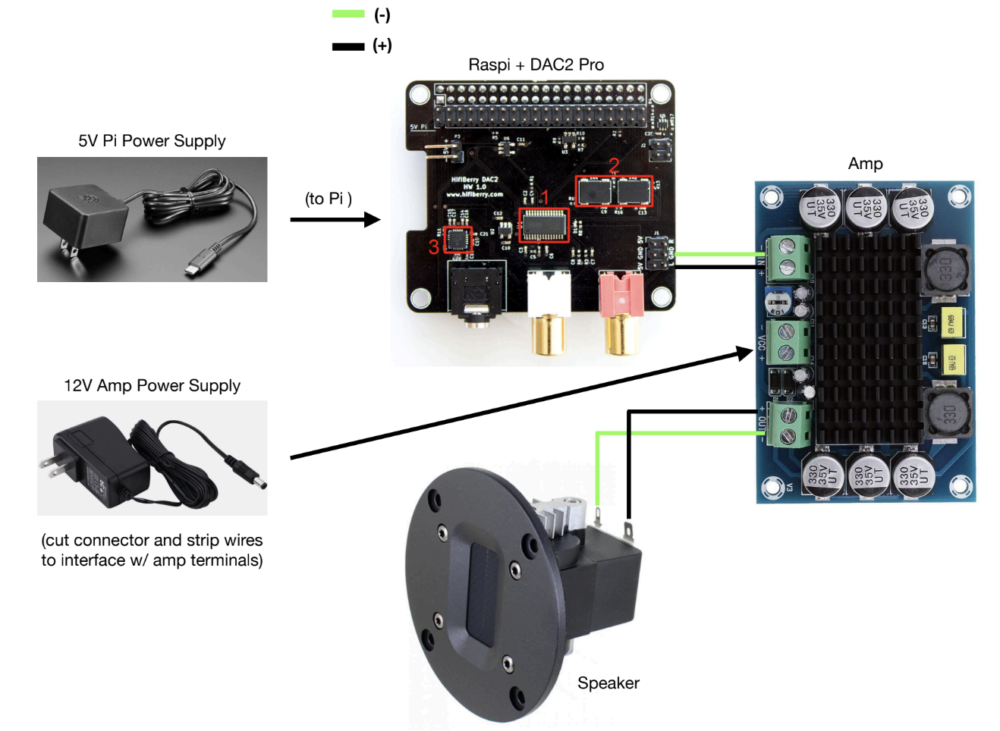
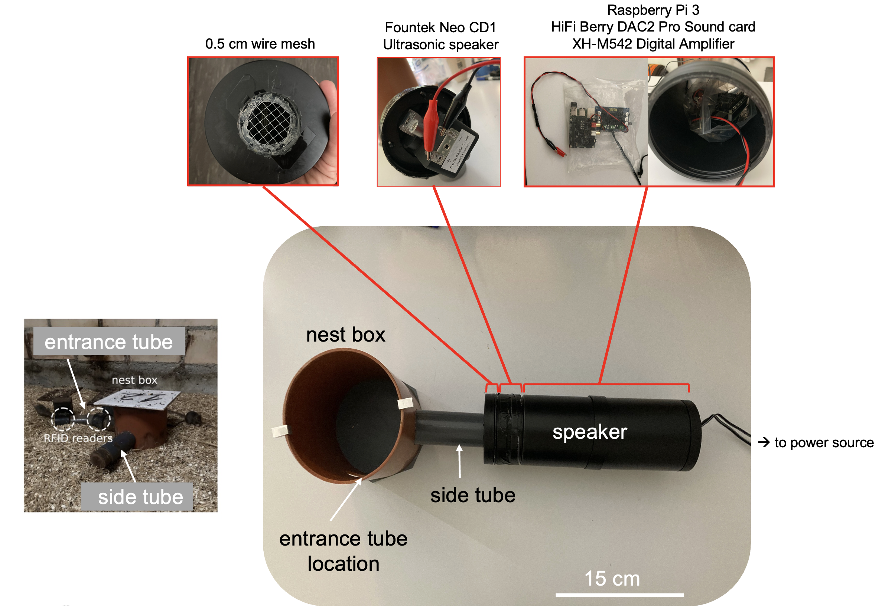

# A cheap ultrasonic microphone

This repository contains a parts list and a protocol for assembling an ultrasonic microphone for ~$200.

**Motivation**:  

Bioacoustics researchers studying rodents and bats need microphones for ultrasonic sound playback. There are very few options that are not extremely expensive. This protocol is intended for researchers who need a relatively cheap option for ultrasound playback, but do not have extensive experience with electronics or sound systems.

**Warnings and disclaimers**:  

1. Verifying that you have a working playback system will require an ultrasonic microphone. Hopefully, if you are recording your own calls for playback, you have access to one already. If not, you might consider a bat detector like [this one](https://batmanagement.com/collections/bat-detector-buyers-guide-active-detectors/products/pettersson-u256-microphone), which is on the less expensive end. You can find several other high-end ultrasonic microphones from a company called [Avisoft](https://avisoft.com/).  

2. This protocol uses a microphone with a published upper frequency limit of 40 kHz, which is below the frequency of many ultrasonic calls made by rodents and bats. However, in my experience it is capable of producing ultrasonic mouse calls in the 60-80 kHz range with minimal distortion. Please consider whether this caveat will be critical for your experiment, and verify that the system is capable of producing your calls at the quality you need before you use it.

3. This microphone system is wired, and will require a power source. For use in the field, you might consider a [portable power station](https://www.amazon.com/Portable-Solar-Panel-Power-Station-Generator-Charger/dp/B08G1KB88B/)

## Parts list

| Item                | Link                                                                                                                                                                                                                                           | Price (USD) |
|---------------------|------------------------------------------------------------------------------------------------------------------------------------------------------------------------------------------------------------------------------------------------|-------------|
| Raspberry Pi 3B     | https://www.adafruit.com/product/3055                                                                                                                                                                                                          | 35.00          |
| HiFi Berry DAC2-pro Sound Card   | https://www.hifiberry.com/shop/boards/dac2-pro/                                                                                                                                                                                                | 44.90        |
| XH-M542Amplifier    | https://www.amazon.com/XH-M542-TPA3116DA-Amplifier-TPA3116D2-Capacity/dp/B07Z461JZX                                                                                                                                                            | 9.95        |
| 64 GB microSD card  | https://www.amazon.com/SanDisk-Extreme-microSDXC-Memory-Adapter/dp/B09X7C7LL1                                                                                                                                                                  | 11.27       |
| Fountek Speaker     | https://www.audiophonics.fr/en/tweeter/fountek-neo-cd10-speaker-driver-ribbon-tweeter-20w-5-ohm-90db-2000hz-40khz-o38cm-p-2865.html                                                                                                            | 90.36       |
| 12V/18W/1.5A power supply | https://www.amazon.com/Chanzon-Switching-100-240V-Transformer-Security/dp/B07G12L4SC                                              | 13.99       |
| Wires with Alligator clips| https://www.amazon.com/WGGE-WG-026-Pieces-Colors-Alligator/dp/B06XX25HFX | 5.69       |  


### Parts description

`Raspberry Pi 3B`: The small computer that will control the speaker and run any code for playback experiments.  

`HiFi Berry DAC2-pro Sound Card`: A device that plugs into the Raspberry Pi, allowing it to play high quality audio.  

`XH-M542 Amplifier`: A device that interfaces between the Raspberry Pi/Sound Card and the speaker. It is needed to amplify signals appropriately before they reach the speaker itself, and is usually extremely expensive. The XH-M542 is about as cheap as you can get.  

`Fountek Speaker`: Where the sound happens. This is a reasonably priced ribbon tweeter capable of playing ultrasonic sound (although see warning). You will attach it directly to the amplifier.  

`12V/18W/1.5A power supply`: This is the power source required by the XH-M542 Amplifier.  


### Additional materials that make set up easier

The above parts constitute the speaker system. The following are tools that will make using the system easier by allowing you to interact with the Raspberry Pi like a normal computer. Using these is the most straightforward way to use the Raspberry Pi, but if you only have access to a personal computer, you can also connect remotely. Instructions for doing that can be found [here](https://www.raspberrypi.com/documentation/computers/remote-access.html).  


| Item                   | Link                                                                                                                       | Price (USD) |
|------------------------|----------------------------------------------------------------------------------------------------------------------------|-------------|
| wired mouse            | https://www.amazon.com/Logitech-B100-Corded-Mouse-Computers/dp/B003L62T7W/                                                 | 7.99        |
| HDMI monitor           | https://www.amazon.com/HAMTYSAN-Raspberry-Pi-Monitor-Non-Touch/dp/B0B8S9DYQC/                                              | 35.99       |
| keyboard               | https://www.amazon.com/AmazonBasics-Matte-Keyboard-QWERTY-Layout/dp/B07WJ5D3H4                                             | 14.63       |
| headphones for testing | https://www.amazon.com/Maxell-High-Quality-Headphones-Adjustable-Lightweight/dp/B00006JPRN/                                | 5.99        |
| HDMI cable             | https://www.amazon.com/AmazonBasics-High-Speed-HDMI-Cable-1-Pack/dp/B014I8SSD0/                                            | 7.19        |
| microSD adapter        | https://www.amazon.com/uni-Adapter-Supports-Compatible-MacBook/dp/B081VHSB2V/                                              | 9.99        |

## Set up the Raspberry Pi + HiFi Sound Card

### Step 1: Download the Raspberry Pi operating system onto your microSD card

1. Attach the microSD card to your computer using the microSD card adapter.  
2. Go to https://www.raspberrypi.com/software/ and download the Raspberry Pi imager. This should get you an interface that walks you through the steps to download the Raspberry Pi operating system for your version of Raspberry Pi (I use 3B here) to your microSD card.  
3. Once that finishes successfully, eject the microSD card from your computer, and slide it into the microSD card slot of your Raspberry Pi.  

### Step 2: Set up the Raspberry Pi
1. Attach the monitor to the Raspberry Pi using the HDMI cable.  
2. Connect the keyboard and mouse to the Raspberry Pi's USB ports.  
3. Connect the Raspberry Pi and monitor to power sources.  
4. You should see a Raspberry Pi welcome screen while it runs through some checks, then follow the setup instructions (location, time zone, wifi, etc.).  
5. Now you should see an intuitive desktop with date/time and wifi in the upper right and a little black "terminal icon" in the upper left.  

### Step 3: Attach the Sound Card to the Raspberry Pi
1. Power off the Raspberry Pi.
2. The Sound card should have come with some little white plastic pegs. Screw those into the corners of the Raspberry **before** you slide Sound Card pins onto two rows of pins (40 total) on the Raspberry Pi. Otherwise you will have to pull the pins out again and risk bending/damaging them.
3. Now slide the sound card firmly onto the pins and screw in the little white posts. 

### Step 3: Configure the Raspberry Pi to recognize the sound card
1. Now power on the Raspberry Pi and connect to the monitor as in step 1.
2. Click on the little black terminal icon - it should be in the upper left on the desktop. 
3. This should open a terminal window where you can type commands and generally interact with the Raspberry Pi. 
4. Go to the "boot" folder, where the `config.txt` configuration file is, either by navigating to it using the mouse or typing `cd \boot\` into the terminal window.
5. Make a copy of the configuration file (in case you need to start over) by using the Desktop interface or typing `cp \boot\config.txt \boot\config_backup.txt`
6. Now open the `config.txt` file, find the line with `dtoverlay`, and replace whatever is there with `dtoverlay=hifiberry-dacplus`
7. Reboot the Raspberry Pi by typing `sudo reboot` into the terminal window and hitting enter.
8. Now in the terminal, type `cat /proc/asound/cards`. You should see something like the following, indicating that the Hifiberry sound card is recognized.  
```
0 [sndrpihifiberry]: HifiberryDacp - snd_rpi_hifiberry_dacplus
					 snd_rpi_hifiberry_dacplus
```

### Step 4: Reset the maximum frequency imposed by Raspberry Pi to match the sample rate of your files.
1. The software that will actually play sounds is called pulseaudio, and should come pre-installed with the Raspberry Pi operating system. You can confirm this by typing `pactl list` into the command line and not getting an error. If for some reason you don't have it, just make sure you are connected to the internet and type `sudo apt-get install pulseaudio`.
2. By default, pulseaudio imposes a maximum sample rate of 44100 Hz, which is not high enough to play most ultrasonic animal calls. You can override this default by editing the pulseaudio configuration file, `daemon.conf`, which should be located in the folder: `/etc/pulse/`
3. Open `daemon.conf` and look for the line that says something like

```
; default-sample-rate = 44100
```

Update the value to match the sample rate of the audio files you want to play back, e.g. 
```
; default-sample-rate = 192000
```

Save the file and reboot the Raspberry Pi (`sudo reboot`).

## Connect the Raspberry Pi + Sound Card to the amplifier and speaker
1. Now you will connect the Raspberry Pi to the amplifier, the amplifier to the speaker, and the amplifier to its power source using the following wiring diagram:



2. 

## Test the speaker
1. Record the ultrasonic calls you would like to play back, manipulate them to suit your experiment, then copy them onto a USB stick.
2. Attach this USB stick to your Raspberry Pi
3. You should now be able to find your files and play them using pulseaudio. For example:

```
play path/to/ultrasonic_calls.wav
```

will play your file.

```
play path/to/ultrasonic_calls.wav repeat 3
```

will play your file 3 times.

See the example_playback_script.sh script in this repository for an example playback experiment. You can run it on your own Raspberry Pi by copying it to the same directory as your audio file, then typing 

```
sh example_playback_script.sh
```
into the Terminal.

4. I suggest playing around with this while recording the playback using a microphone set at a distance that approximately matches the distance from the microphone to the vocalizing animal at the time of the recording. Change the gain on the amplifier (hence the loudness of the playback) by turning the screw marked "VOL", but note that this screw is EXTREMELY sensitive. Be careful not to blow out your speaker. Tune the gain until the amplitude of the playback call matches that for the original audio. Depending on your needs, this match can be approximate.

5. Repeat 1-4 for as many files as you need for playback.

6. Now you should be ready to package everything in a more stable arrangement. Depending on your needs, this could involve welding the wires to the speaker instead of using alligator clips, putting everything in a plastic case, etc. I have used the setup below in the field to play back mouse ultrasonic calls into boxes containing groups of mice:




