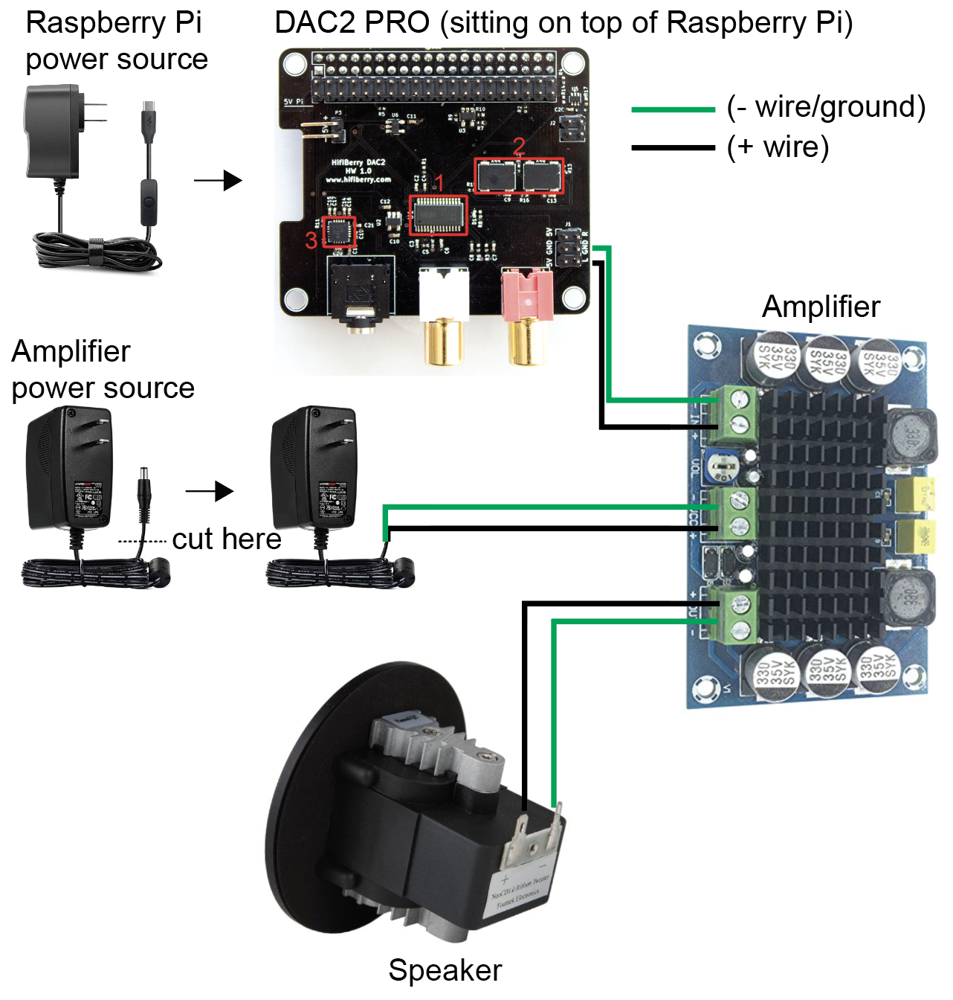
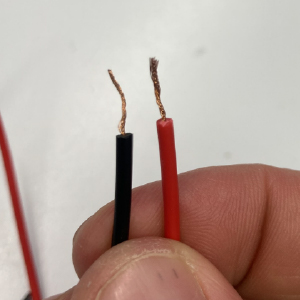

# A cheap ultrasonic speaker

This repository contains a parts list and a protocol for assembling an ultrasonic speaker for ~$200.

**Motivation**:  

Bioacoustics researchers studying rodents and bats need speakers for ultrasonic sound playback. There are very few options that are not extremely expensive. This protocol is intended for those who need a relatively cheap option for ultrasound playback, and who do not have extensive experience with electronics or sound systems.

**Warnings and disclaimers**:  

1. Verifying that you have a working playback system will require an ultrasonic microphone. Hopefully, if you are recording your own calls for playback, you have access to one already. If not, you might consider a bat detector like [this one](https://batmanagement.com/collections/bat-detector-buyers-guide-active-detectors/products/pettersson-u256-microphone), which is on the less expensive end. You can find several other high-end ultrasonic microphones from a company called [Avisoft](https://avisoft.com/).  

2. This protocol uses a speaker with a published upper frequency limit of 40 kHz, which is below the frequency of many ultrasonic calls made by rodents and bats. However, in my experience it is capable of producing ultrasonic mouse calls in the 60-70 kHz range with no visible distortion. Please consider whether this caveat will be critical for your experiment, and verify that the system is capable of producing your calls at the quality you need before you use it.

3. This speaker system will require a wired power source. For use in the field, you might consider a [portable power station](https://www.amazon.com/Portable-Solar-Panel-Power-Station-Generator-Charger/dp/B08G1KB88B/)

## Parts list

| Item                | Link                                                                                                                                                                                                                                           | Price (USD) |
|---------------------|------------------------------------------------------------------------------------------------------------------------------------------------------------------------------------------------------------------------------------------------|-------------|
| Raspberry Pi 3B     | https://www.adafruit.com/product/3055                                                                                                                                                                                                          | 35.00          |
| HiFiBerry DAC2 Pro Sound Card   | https://www.hifiberry.com/shop/boards/dac2-pro/                                                                                                                                                                                                | 44.90        |
| XH-M542 Amplifier    | https://www.amazon.com/XH-M542-TPA3116DA-Amplifier-TPA3116D2-Capacity/dp/B07Z461JZX                                                                                                                                                            | 9.95        |
| 64 GB microSD card  | https://www.amazon.com/SanDisk-Extreme-microSDXC-Memory-Adapter/dp/B09X7C7LL1                                                                                                                                                                  | 11.27       |
| Fountek Speaker     | https://www.audiophonics.fr/en/tweeter/fountek-neo-cd10-speaker-driver-ribbon-tweeter-20w-5-ohm-90db-2000hz-40khz-o38cm-p-2865.html                                                                                                            | 90.36       |
| 12V/18W/1.5A power supply | https://www.amazon.com/Chanzon-Switching-100-240V-Transformer-Security/dp/B07G12L4SC                                              | 13.99       |
| Alligator clip wires | https://www.amazon.com/WGGE-WG-026-Pieces-Colors-Alligator/dp/B06XX25HFX | 5.69       |  
| Breadboard wires  | https://www.amazon.com/California-JOS-Breadboard-Optional-Multicolored/dp/B0BRTHR2RL/ | 3.99 |


### Parts description

`Raspberry Pi 3B`: The small computer that will control the speaker and run any code for playback experiments.  

`HiFiBerry DAC2-pro Sound Card`: A device that plugs into the Raspberry Pi, allowing it to play high quality audio.  

`XH-M542 Amplifier`: A device that interfaces between the Raspberry Pi/Sound Card and the speaker. It is needed to amplify signals appropriately before they reach the speaker itself. Amplifiers are usually quite expensive, but the XH-M542 is very cheap for what it does.

`Fountek Speaker`: Where the sound happens. This is a reasonably priced ribbon tweeter capable of playing ultrasonic sound (although see warning). You will attach it directly to the amplifier.  

`12V/18W/1.5A power supply`: This is the required power supply for the XH-M542 amplifier. 

`Alligator clip wires`: These are the wires that will connect the amplifier to the speaker (at least during prototyping).

`Breadboard wires`: These are the wires that will connect the Raspberry Pi to the amplifier (at least during prototyping).


### Additional materials that make set up easier

The above parts constitute the speaker system. The following are tools that will make using the system easier by allowing you to interact with the Raspberry Pi like a normal computer. I think this is the approach that requires the least technical know-how, but if you only have access to a personal computer, you can also connect remotely. Instructions for doing that can be found [here](https://www.raspberrypi.com/documentation/computers/remote-access.html).  


| Item                   | Link                                                                                                                       | Price (USD) |
|------------------------|----------------------------------------------------------------------------------------------------------------------------|-------------|
| wired mouse            | https://www.amazon.com/Logitech-B100-Corded-Mouse-Computers/dp/B003L62T7W/                                                 | 7.99        |
| HDMI monitor           | https://www.amazon.com/HAMTYSAN-Raspberry-Pi-Monitor-Non-Touch/dp/B0B8S9DYQC/                                              | 35.99       |
| keyboard               | https://www.amazon.com/AmazonBasics-Matte-Keyboard-QWERTY-Layout/dp/B07WJ5D3H4                                             | 14.63       |
| headphones for troubleshooting (no ultrasound) | https://www.amazon.com/Maxell-High-Quality-Headphones-Adjustable-Lightweight/dp/B00006JPRN/                                | 5.99        |
| HDMI cable             | https://www.amazon.com/AmazonBasics-High-Speed-HDMI-Cable-1-Pack/dp/B014I8SSD0/                                            | 7.19        |
| microSD adapter        | https://www.amazon.com/uni-Adapter-Supports-Compatible-MacBook/dp/B081VHSB2V/                                              | 9.99        |

## Set up the Raspberry Pi and HiFiBerry Sound Card

### Step 1: Download the Raspberry Pi operating system onto your microSD card

1. Attach the microSD card to your computer using the microSD card adapter.  
2. Go to https://www.raspberrypi.com/software/ and download the Raspberry Pi imager. This should get you an interface that walks you through the steps to download the Raspberry Pi operating system for your version of Raspberry Pi (I use 3B here) to your microSD card.  
3. Once that finishes successfully, eject the microSD card from your computer, and slide it into the microSD card slot of your Raspberry Pi.  

### Step 2: Set up the Raspberry Pi
1. Attach the monitor to the Raspberry Pi using the HDMI cable.  
2. Connect the keyboard and mouse to the Raspberry Pi's USB ports.  
3. Connect the Raspberry Pi and monitor to power sources.  
4. You should see a Raspberry Pi welcome screen while it runs through some checks, then follow the setup instructions (location, time zone, wifi, etc.).  
5. Now you should see an intuitive desktop with date/time and wifi in the upper right and a little black "terminal icon" in the upper left.  

### Step 3: Attach the Sound Card to the Raspberry Pi
1. Power off the Raspberry Pi.
2. The sound card likely comes with some little white plastic pegs to help secure it on top of the Raspberry Pi. Screw those into the corners of the Raspberry **before** you slide Sound Card pins onto two rows of pins (40 total) on the Raspberry Pi. Otherwise you will have to pull the pins out again and risk bending/damaging them.
3. Now slide the sound card firmly onto the pins and screw in the little white posts. 

### Step 4: Configure the Raspberry Pi to recognize the sound card
1. Now power on the Raspberry Pi and connect to the monitor as in step 1.
2. Click on the little black terminal icon - it should be in the upper left on the desktop. 
3. This should open a terminal window where you can type commands and generally interact with the Raspberry Pi. 
4. Go to the "boot" folder, where the `config.txt` configuration file is, either by navigating to it using the mouse or typing `cd /boot/` into the terminal window.
5. Make a copy of the configuration file (in case you need to start over) by using the Desktop interface or typing `cp /boot/config.txt /boot/config_backup.txt`
6. Now open the `config.txt` file (e.g., with `sudo nano /boot/config.txt`), find the line with `dtoverlay`, and replace whatever is there with `dtoverlay=hifiberry-dacplus`. It is possible that there is no line with "dtoverlay". If not, just copy/paste `dtoverlay=hifiberry-dacplus` into the file and save.
7. Reboot the Raspberry Pi by typing `sudo reboot` into the terminal window and hitting enter.
8. Now in the terminal, type `cat /proc/asound/cards`. You should see something like the following, indicating that the Hifiberry sound card is recognized.  
```
0 [sndrpihifiberry]: HifiberryDacp - snd_rpi_hifiberry_dacplus
					 snd_rpi_hifiberry_dacplus
```

### Step 5: Reset the maximum frequency imposed by pulseaudio to match the sample rate of your files.
1. In order to play sound, the Raspberry Pi needs two software programs: SoX, the audio player that actually plays the sound, and PulseAudio, an audio server that interfaces between SoX and the sound card. Both should come pre-installed with the Raspberry Pi operating system - you can confirm this by running `sox --version` (to confirm SoX) and `pulseaudio --version` (to confirm pulseaudio). If for any reason you need to download these, just make sure you are connected to the internet and do `sudo apt install sox` and/or `sudo apt install pulseaudio`
2. SoX is capable of playing ultrasound, but pulseaudio imposes a maximum frequency of (usually) 44100 Hz or 48000 Hz. That means that even if you play an ultrasonic call and have a sound card capable of handling its high sampling rate, pulseaudio will down-sample to 44100 or 48000 Hz before sending data to the sound card. 
3. Fortunately, you can override this default by editing the pulseaudio configuration file, `daemon.conf`, which should be located in the folder: `/etc/pulse/`. If you can't find it there, check here: `~/.config/pulse/`, where ~ is short for the path to your home directory, usually with the same name as your username.
4. Open `daemon.conf` and look for the line that says something like

```
; default-sample-rate = 44100
```

Note that the semi-colon indicates that this is commented out. Update the value to match the sample rate of the audio files you want to play back and uncomment, e.g. 
```
sudo nano /etc/pulse/daemon.conf
```

then

```
default-sample-rate = 192000
```

Save the file and reboot the Raspberry Pi (`sudo reboot`).

## Wire everything together
Now you will connect the Raspberry Pi to the amplifier, the amplifier to the speaker, and the amplifier to its power source using the following wiring diagram kindly made by Ralph Peterson:



1. Prepare your wires  
	**a**. Take two alligator clip wires (ideally one black and one red), cut off one end of each with scissors, then strip the cut end to expose the copper wire. You will use these to connect the OUT terminal of the amplifier to the speaker. Expose just enough wire to be able to securely clamp it into the amplifier terminals. For example:
	
	
	
	**b**. Do the same for two breadboard wires (cut off one end, leaving the socket end on, and strip to reveal wire). You will use these to connect the sound card to the IN terminal of the amplifier.  
	**c**. Take your 12 V power source and cut the end off of it (i.e., the "plug" that you would normally insert into an appliance). After cutting off the plug, you should see two smaller wires inside the cable. One wire carries the positive voltage, and the other is negative. Typically, the red wire is positive and the black wire is negative, but when in doubt double-check using a multimeter or follow any markings on the cable that indicate which is which.
	
2. **Without plugging the Raspberry Pi power source into an outlet**, plug the USB end into the Raspberry Pi's power port.
	
3. Connect the sound card to the amplifier using your wires with two stripped ends  
    **a**. Find the sound card analog output pins: these are next to the red audio jack and are labeled L (left), GND (ground), and R (right), indicated by "5" below, from the [DAC2 Pro documentation](https://www.hifiberry.com/docs/data-sheets/datasheet-dac2-adc-pro/)
		
	
	
	Insert the red breadboard wire onto the left pin (pin 6), and the black breadboard wire onto the ground pin (pin 4). Note were are only wiring for one audio channel.
	
	**b**. Connect the black ground wire to the - (negative) port on the amplifier IN terminal. A small flat-head screw driver is helpful. Just loosen the clamp, insert the stripped end of the wire, then tighten it until secure.
	
	**c**. Do the same to connect the red wire to the + (positive) port on the amplifier IN terminal. 
	
4. **Without plugging the amplifier power source into an outlet**, connect the power source to the VCC terminal on the amplifier. As you did above for the IN terminal, loosen the - clamp of the VCC terminal, insert the stripped black wire from the power source, and tighten. Do the same for the red wire in the power source and the + clamp of the VCC terminal.

5. Connect the speaker to the amplifier. Insert the stripped end of the black alligator clip into the - port of the amplilfier's OUT terminal and tighten until secure. Do the same for the stripped end of the red alligator clip and the + port. The speaker has two little metal tabs sticking up from its back, marked with a + and a -. Attach the red alligator clip to the + tab and the black alligator clip to the - tab.

Now you should have something that looks roughly like this:


To give everything power, all you need to do is plug in the Raspberry Pi and amplifier power sources into outlets. 

**Be careful!** This is DIY electrical wiring here. Before powering on, check:

   - Make sure there are no loose wires and that all terminal clamps are tight and secure
   - Make sure all + terminals connect to +, all - to -
   - Make sure there are no stray or exposed wires that could potentially touch
   - Double check the voltage of the power supply is correct


## Test the speaker
1. Record the ultrasonic calls you would like to play back, manipulate them to suit your experiment, then copy them onto a USB stick.
2. Attach this USB stick to your Raspberry Pi
3. You should now be able to find your files and play them. For example:

```
play path/to/ultrasonic_calls.wav
```

will play your file.

```
play path/to/ultrasonic_calls.wav repeat 3
```

will play your file 3 times.  

You can also play synthetic sounds, which can be a good way to test sensitivity across a frequency range. For example,

```
play -n synth 2 sin 70000 vol -10dB
```

will play a 70 kHz sine wave for 2 seconds (using vol -10dB to reduce output volume)

See the example_playback_loop.sh script in this repository for an example playback experiment, and example_sensitivity_test.sh for a script that loops through synthetic tones at different ultrasonic frequencies. You can run it on your own Raspberry Pi by copying it to the same directory as your audio file, then typing 

```
sh path/to/example_playback_loop.sh
```
or
```
sh path/to/example_sensitivity_test.sh
```

into the Terminal.

4. I suggest playing around with these while recording the speaker output using an ultrasonic microphone. You might consider setting the microphone at a distance from the speaker that matches the distance from the microphone to the vocalizing animal at the time of the recording. This will allow you to (approximately) match the loudness of the call to the loudness of the vocalizing animal. To change loudness, change the gain on the amplifier by turning the screw marked "VOL", but note that this screw is **EXTREMELY** sensitive. Be careful not to blow out your speaker. Here's an example of what a testing setup with microphone might look like:


6. Once you have the files you want to play back calibrated to the loudness you want, you're ready to package the speaker in a more stable arrangement. Depending on your needs, this could involve soldering the wires to the speaker instead of using alligator clips, putting everything in a plastic case, etc. For example, the setup below was used to play back ultrasonic mouse calls into boxes containing groups of mice:


## Acknowledgements

Thank you to Ralph Peterson, who was extremely helpful with getting this system to work.


